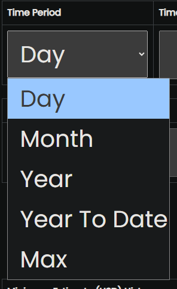

## 📑 Table of Contents
- [Installation](#-installation)
- [Usage](#-usage)
- [Examples](#-examples)
- [Contributing](#-contributing)
- [Dependencies](#-dependencies)
- [Future Improvements](#-future-improvements)
- [License](#-license)


## 🚀 Installation
Step 1: Use the following command in a terminal: 
  
```bash
git clone https://github.com/KanayaPatel/Valuation-Project.git
```

---

Step 2: Use the following command: 
  
```bash 
python3.11 venv venv
```

This creates a python virtual environment (this will take a minute). After finishing, activate it using

```bash
venv/Scripts/activate
```

 Both these commands happen in the terminal. 

---

Step 3: Enter the project folder using: 

```bash 
cd '.\Finance Project\'
```

Then, also do the following:
   
```
pip install -r "requirements.txt"
```
this may take a minute. 

---

Step 4: Open the ```app.py``` folder and run it. From the terminal, press CTRL + Left click on the second or third line that says "Running On" (shown below). This will take you to the actual webpage. 

<p align="center"></p>


  
  
## 🛠 Usage
At this point in time, you should see a webpage that should look like the following: 


Click on the information button to learn about this project. The webpage should look like this: 


If you wish to go back to the previous page at any time, there is always a button in the top left corner that will take you back to the previous page. After reading, click the "Get Started" button at the bottom of the screen. It will take you to the main page where predictions are made: 


Please read through the instructions and the notes at the bottom. Below will be some examples in the form of screenshots on how to use this predictor. 

## 📊 Examples

For the first field (the Time Period), you get the selection from the following: Day, Month, Year, Year to Date, and Max, as shown below. These selections specify how much data to use in the predictions. That is, if 'Day' is chosen, the predictor will use valuation data within the last day. The more data you use, the better the predictions but the longer the processing time. 

<p align='center'></p>

For the second field (the Time Amount), you get to input how many Days, Months, or Years worth of data you wish to use for the prediction. Note that you must choose a number that is probable. That is, using the number 1,000,000 will not work. Try using smaller numbers such as 1 or 3 for best results. 

<p align='center'></p>

For the third field (the Data Type), you get the selection from the following: Low, High, Open, Close, Volume. These denote specific valuations. The volume, however, does NOT denote the price of the stock in question, but rather how many stocks are out at the time. 

<p align='center'></p>

For the fourth field (the Ticker Symbol), you get to choose a company to predict stock from! Choose any company you wish. However, be careful of using new and upcoming companies, as their data may not exist or the Time Amount chosen may be incorrect. Ensure that there is enough data to make good predictions. NOTE: For the image below, "AAPL" is the Ticker Symbol for Apple.

<p align='center'></p>

Here is an image of all fields being filled as well as there being an output! Note that the current values are stored temporarily in their respective tables. In the case of you choosing 'volume' as the data type, ignore the label (USD) and interpret the value given as a number of stocks. 


This is what it looks like after pressing "Next Step": 


## 🤝 Contributing
You can contribute in several ways:
- 🐛 Reporting bugs
- 💡 Suggesting new features
- 📝 Improving documentation
- 🔧 Submitting code via Pull Requests
  
## 📦 Dependencies
This project uses the following libraries and APIs (these were already applied in the Installation step at the top of the page):

- [Yahoo Finance API](https://finance.yahoo.com/) via [yfinance](https://pypi.org/project/yfinance/)
- [Pandas](https://pandas.pydata.org/) – data manipulation
- [Matplotlib](https://matplotlib.org/) – visualization
- [Prophet](https://facebook.github.io/prophet/) – forecasting

## 🙏 Acknowledgements
- Some helper functions and code snippets were suggested by ChatGPT (OpenAI)

## 🚧 Future Improvements
- [ ] Add the ability to save estimates for future use. 
- [ ] Implement login (Username and Password)
- [ ] Implement the ability to use non-Ticker Symbol using companies (such as Samsung)
- [ ] Include a spot to display the error in the estimates.

## 📜 License
This project is licensed under the MIT License – see the [LICENSE](LICENSE) file for details.
